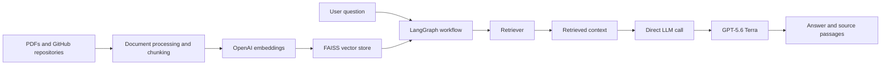

# AI Career Profile Assistant

A Streamlit-based career profile assistant designed to help users search and understand Jayant Prakash's professional experience, skills, education, projects, and accomplishments. It answers questions using local PDF documents, GitHub repository information, while combining retrieval-augmented generation (RAG) with a LangGraph workflow powered by OpenAI GPT-5.6 Terra through a direct LLM call.

Example questions include:

- What professional experience does Jayant have?
- Which technologies and programming languages has Jayant worked with?
- What are Jayant's most relevant projects for a machine-learning role?
- What education, certifications, and accomplishments are listed in Jayant's profile?

## Features

- Loads and indexes PDF, text, web, and GitHub profile content.
- Retrieves relevant passages with OpenAI embeddings and FAISS.
- Uses a LangGraph workflow with document retrieval followed by a direct LLM call.
- Generates answers with GPT-5.6 Terra through the OpenAI Responses API.
- Displays retrieved source passages and recent searches in Streamlit.
- Caches the initialized RAG pipeline for faster follow-up questions.

## How it works



The default Streamlit application indexes:

- `src/data/Jayant_Prakash_Resume.pdf`
- `src/data/LinkedInProfile.pdf`
- Public, non-forked repositories and README files from `github.com/JayantPrakash`

## Requirements

- Python 3.12 or newer
- An OpenAI API key with access to `gpt-5.6-terra`
- A GitHub personal access token is strongly recommended because the application makes multiple GitHub API requests during initialization

## Setup

Clone the repository and enter the project directory:

```bash
git clone https://github.com/JayantPrakash/RAG-Document-Search.git
cd RAG-Document-Search
```

### Install with `uv`

```bash
uv sync
```

### Install with `pip`

Windows PowerShell:

```powershell
python -m venv .venv
.venv\Scripts\Activate.ps1
python -m pip install -r requirements.txt
```

macOS or Linux:

```bash
python3 -m venv .venv
source .venv/bin/activate
python -m pip install -r requirements.txt
```

## Environment variables

Create a `.env` file in the project root:

```env
OPENAI_API_KEY=your_openai_api_key
GITHUB_TOKEN=your_github_personal_access_token
```

`OPENAI_API_KEY` is required for embeddings and answer generation. `GITHUB_TOKEN` authenticates GitHub API requests and provides a higher rate limit than anonymous access.

Use a fine-grained GitHub token with the minimum required access:

- Repository access: public repositories
- Repository permission: **Contents — Read-only**

Never commit `.env` or expose either token. The repository's `.gitignore` excludes `.env`.

## Run the application

With the virtual environment active:

```bash
streamlit run streamlit_app.py
```

Or with `uv`:

```bash
uv run streamlit run streamlit_app.py
```

Open the local URL printed by Streamlit, usually `http://localhost:8501`.

Initialization downloads GitHub repository data, processes the local PDFs, creates embeddings, and builds an in-memory FAISS index. The first startup can therefore take longer than subsequent interactions.

## Configuration

Core settings are defined in `src/config/config.py`:

```python
LLM_MODEL = "openai:gpt-5.6-terra"
CHUNK_SIZE = 500
CHUNK_OVERLAP = 50
```

The model is initialized with `use_responses_api=True` and invoked directly after document retrieval to generate the final answer.

To index different documents or a different GitHub profile, update the source paths and `github_url` in `initialize_rag()` inside `streamlit_app.py`.

## Project structure

```text
RAG-Document-Search/
├── streamlit_app.py                 # Streamlit interface and initialization
├── pyproject.toml                   # Project metadata and dependencies
├── requirements.txt                 # pip dependencies
└── src/
    ├── config/config.py             # API and model configuration
    ├── data/                        # Local source documents
    ├── document_ingestion/
    │   └── document_processor.py    # PDF, text, web, and GitHub loading
    ├── graph_builder/
    │   └── graph_builder.py         # LangGraph workflow
    ├── node/
    │   └── nodes.py                 # Retriever and LLM response nodes
    ├── state/rag_state.py           # Workflow state model
    └── vectorstore/vectorstore.py   # OpenAI embeddings and FAISS index
```
